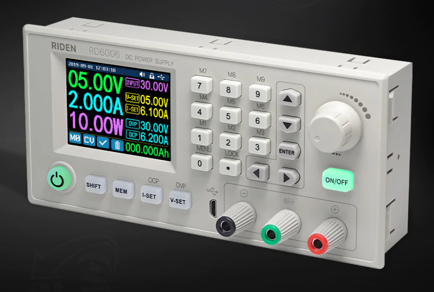
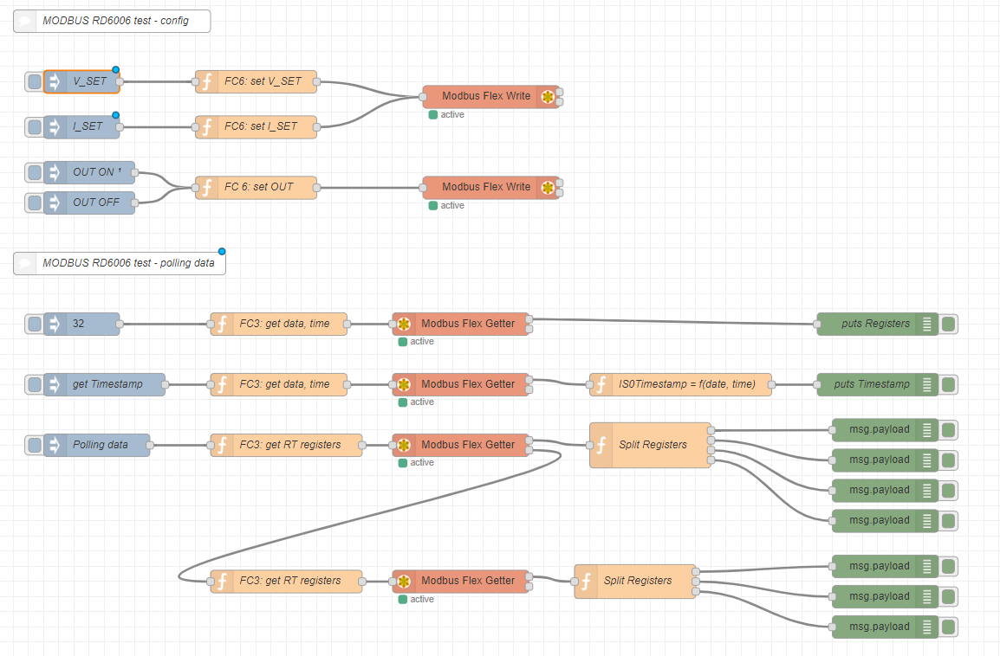

# RD6006-Super-power-supply
A intelligent Power supply with PC control and logging, for very long test (battery cycles)
## Owerview
The RD6006-W power supply is a fantastic professional tool, providing up to 60V, 6A (360 Watt), very complete with high level functions. It is also possible to control it from the front panel, or via WIFI with an APP from a smartphone, or via USB with a software on PC WIN. See [https://it.aliexpress.com/item/4000282551930.html](https://it.aliexpress.com/item/4000282551930.html "RD official store")

In this period I am interested in rechargeable batteries (see [https://github.com/msillano/e3DHW-PMS](https://github.com/msillano/e3DHW-PMS "e3DHW power management system")), and I have immediately thought of using this splendid hardware.
Although very complete, the supplied software is generic, not aimed at my purposes. In particular:

- Only Excel export, and limited to 24h (with APP, with WIN it is not defined).
- It does not export the battery voltage nor the battery temperature.
- Possibility of programming only based on time, and not on other trigger events

See also:

- [https://github.com/rfinnie/rdserialtool](https://github.com/rfinnie/rdserialtool)  CLI in Python and  [https://github.com/Black-FX/rdserialtool](https://github.com/Black-FX/rdserialtool) UI extension.
 
## ModBus test RD6006
After finding sufficient information on the MODBUS protocol used (see file [RD6006_prototocol_en.pdf](RD6006_prototocol_en.pdf "RD6006 prototocol reverse engineering")), the solution to use ***node-red*** is the fastest and most flexible, because it requires very little programming. Furthermore
***node-red*** is compatible with many environments: windows, Linux, Android, Raspberry...

This first simple flow is useful for tests: you can quickly write and read RD6006 registers.

**Installation**

I used the USB-serial connection, on WIN10 with the `CH341SER` driver. Once connected, in *devices* it is present with the name 'USB-SERIAL.CH340 (COM10)'.

- Add to the ***node-red** palette* the package *node-red-contrib-modbus* (see [https://github.com/BiancoRoyal/node-red-contrib-modbus](https://github.com/BiancoRoyal/node-red-contrib-modbus "node-red-contrib-modbus"))
- Copy the contents of the file [ModBus_test_RD6006.json](ModBus_test_RD6006.json "ModBus test RD6006") to the clipboard and import it into a new flow in ***node-red***.
- More use informations are in the comment nodes.

## NiMH battery charger
This *flow* uses the RD6006 to get a simple but complete NiMH battery charger-logger.
Project miograted to [https://github.com/msillano/NiMH_charger_logger](https://github.com/msillano/NiMH_charger_logger)

